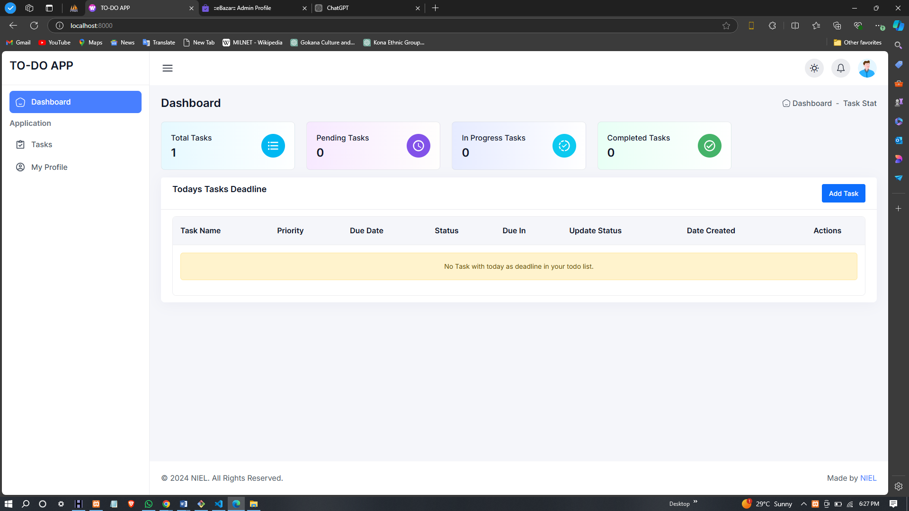
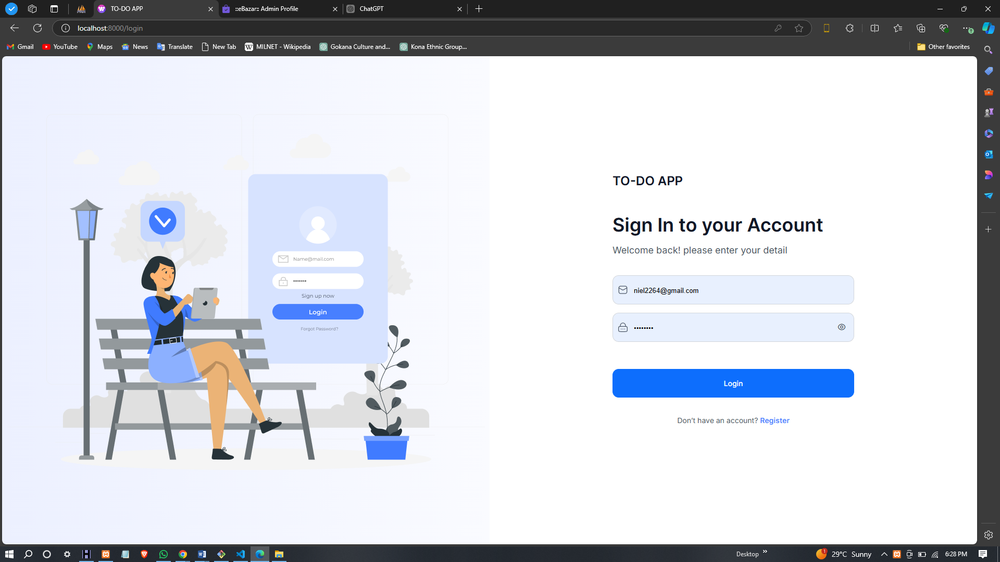
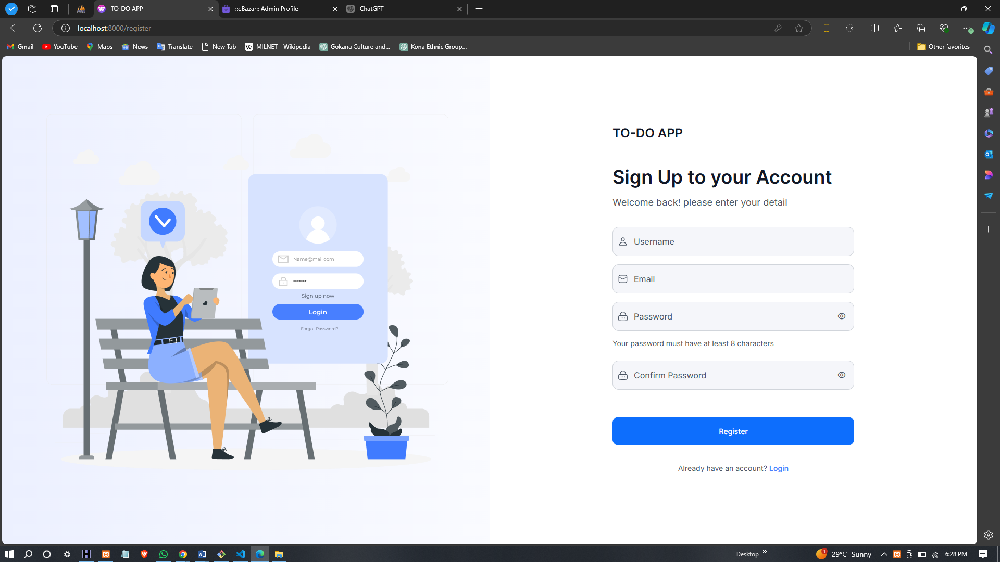
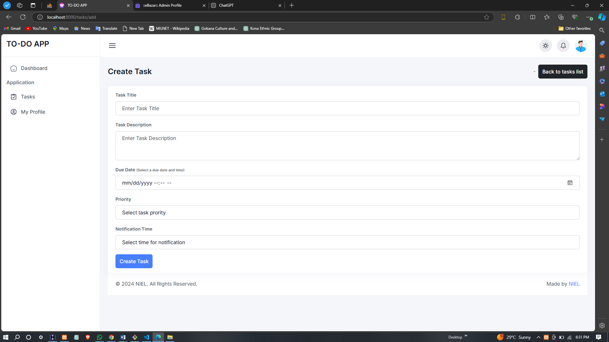
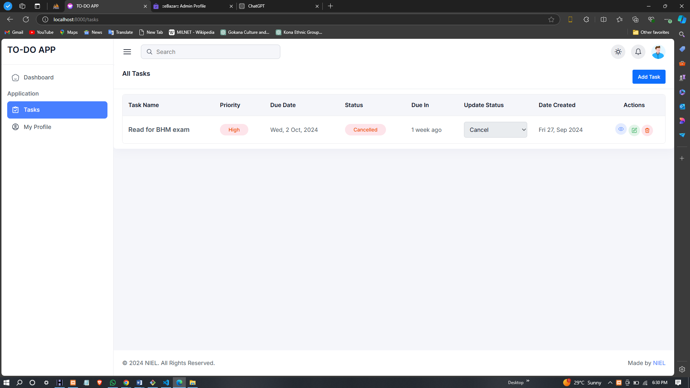
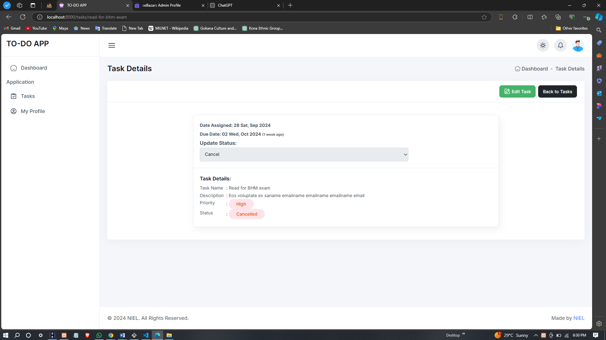
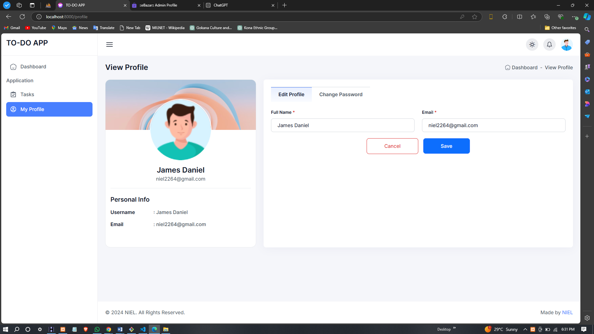

# DESIGN AND IMPLEMENTATION OF A TO-DO LIST APPLICATION

This project is focused on the **Design and Implementation of a To-Do List Application** that allows users to create, manage, and prioritize their tasks effectively. The application is built to help users stay organized by providing an intuitive interface for task management.

---

## Features

### 1. **User Authentication**
The To-Do List Application features a secure login and registration system. Users can sign up for an account and log in to manage their tasks. Authentication ensures that each user has a personalized experience and secure access to their task list. 

---

### 2. **Task Creation**
Users can create new tasks by providing details like the task name, description, and due date. The system validates the inputs to ensure no incomplete or incorrect data is entered.

---

### 3. **Task Editing and Deletion**
Once a task is created, users have the ability to edit or delete tasks. Changes are updated in real-time, providing immediate feedback to users.

---

### 4. **Task Prioritization**
Users can assign priority levels (high, medium, low) to their tasks. This allows them to organize their tasks based on urgency and importance, helping them focus on the most critical tasks.

---

### 5. **Completion Tracking**
The application allows users to mark tasks as completed. Completed tasks are moved to a separate section for easy visual distinction from pending tasks. This helps users keep track of their progress and maintain productivity.

---

### 6. **Responsive Design**
The application’s user interface is designed to be responsive across various devices, including desktops, tablets, and mobiles. The layout adapts to different screen sizes, ensuring a consistent user experience.

---

### 7. **Database Integration**
Data is stored in a relational database, ensuring task persistence across sessions. Users' tasks are securely linked to their accounts and remain available even after logging out or closing the application.

---

## Technologies Used

This project was built using the following technologies:

---

## Screenshots

Here are some screenshots of the To-Do List Application:

### Dashboard
_A snapshot of the main dashboard where users can view all their tasks and manage them._

---

### Login Page
_A simple login page that allows users to securely log into their accounts._

---

### Register Page
_The registration page for new users to create an account._

---

### Create Task Page
_A page for users to input details and create new tasks, including task name, description, and due date._

---

### Tasks List
_This page displays the user's tasks in a list format, with options to edit, delete, and prioritize._

---

### Task Details
_Users can view detailed information about each task, such as its description and due date._

---

### User Profile
_The profile page where users can update their account details and manage personal preferences._

---

## Conclusion

The **To-Do List Application** has been successfully implemented to provide an easy-to-use interface for users to manage and prioritize their tasks. By using modern web technologies like **HTML**, **CSS**, **Bootstrap**, **JavaScript**, **Laravel**, and **Livewire**, the application offers a smooth and responsive experience. With features such as task creation, editing, prioritization, and secure user authentication, the application serves as a powerful tool to help users stay organized and productive.

For any questions or feedback, feel free to reach out:

**Contact**: [niel2264@gmail.com](mailto:niel2264@gmail.com)
